# Proyecto - Dando vida a los objetos de una tienda de regalos para la gestión de inventarios

## Objetivo General:
Introducirte de manera práctica en los conceptos fundamentales de la programación orientada a objetos (POO).
Al realizar esta práctica, podrás:
- Comprender la idea de clase y objeto: Aprenderás a modelar entidades del mundo real ( como Televisión) clases en un programa y a crear instancias de esas clases (objetos).
- Dominar atributos y métodos: Entenderás cómo definir las características (atributos) y comportamientos (métodos) de un objeto.
- Practicar encapsulación: Aprenderás a proteger los datos internos de una clase y a proporcionar acceso controlado a ellos a través de métodos.
Introducirte de manera práctica en los conceptos fundamentales de la programación orientada a objetos (POO) y la gestión de inventarios en una tienda de regalos. Al realizar esta práctica, podrás:
- Comprender la idea de clase y objeto: Aprenderás a modelar entidades del mundo real (como Televisión) como clases en un programa y a crear instancias de esas clases (objetos).
- Dominar atributos y métodos: Entenderás cómo definir las características (atributos) y comportamientos (métodos) de un objeto.
- Practicar encapsulación: Aprenderás a proteger los datos internos de una clase y a proporcionar acceso controlado a ellos a través de métodos.
- Aplicar conceptos básicos de POO: Refuerzarás tus conocimientos sobre conceptos como constructor, getters y setters.
- Aplicar conceptos de relaciones entre clases con cardinalidad: Aprenderás a definir y manejar las relaciones entre diferentes clases, incluyendo la cardinalidad de dichas relaciones.
- Aplicar conceptos de herencia y reutilización de métodos: Entenderás cómo crear jerarquías de clases y reutilizar métodos en clases derivadas.
- Desarrollar habilidades de resolución de problemas: Pondrás en práctica tu capacidad para analizar un problema, diseñar una solución y traducirla a código.
- Gestionar inventarios: Aprenderás a implementar y manejar un sistema de inventarios para una tienda de regalos, incluyendo la adición, eliminación y búsqueda de productos.

## Objetivos Específicos:
Modelar un concepto del mundo real:
- Aprenderás a representar una entidad tangible (Libro, Televisión) como una clase en un lenguaje de programación como Java.
- Implementar atributos y métodos: Definirás las características de un Libro (título, autor, etc.) como atributos y las acciones que puede realizar (comprar, vender) como métodos.
- Utilizar encapsulación: Protegerás los datos internos de la clase (atributos) y controlarás el acceso a ellos a través de métodos públicos (getters y setters).
- Crear objetos: Instanciarás múltiples objetos de la clase Libro, cada uno representando un libro diferente.
- Interactuar con objetos: Utilizarás los métodos definidos para modificar y obtener información de los objetos.
- Comprender el ciclo de vida de un objeto: Observarás cómo se crean, modifican y destruyen los objetos durante la ejecución del programa.
- Crear relaciones entre clases con cardinalidad: Definirás y manejarás las relaciones entre diferentes clases, incluyendo la cardinalidad de dichas relaciones (asociación, agregación, composición y generalización).
- Gestionar inventarios: Implementarás y manejarás un sistema de inventarios para una tienda de regalos, incluyendo la adición, eliminación y búsqueda de productos.
- Aplicar conceptos de herencia y reutilización de métodos: Crearás jerarquías de clases y reutilizarás métodos en clases derivadas.
- Desarrollar habilidades de resolución de problemas: Analizarás un problema, diseñarás una solución y la traducirás a código.

## Arquitectura de Tres Capas

Este proyecto sigue una arquitectura de tres capas para asegurar una separación clara de responsabilidades y mejorar la mantenibilidad del código. Las tres capas son:

### 1. Capa de Presentación (UI)
La capa de presentación es responsable de interactuar con el usuario. Esta capa contiene las clases que manejan la interfaz de usuario y la lógica de presentación.

- **Paquete**: `presentacion`
- **Responsabilidades**:
  - Capturar la entrada del usuario.
  - Mostrar la salida al usuario.
  - Interactuar con la capa de negocio para realizar operaciones.

### 2. Capa de Negocio (Business Logic)
La capa de negocio contiene la lógica de negocio de la aplicación. Esta capa actúa como intermediario entre la capa de presentación y la capa de datos.

- **Paquete**: `negocio`
- **Responsabilidades**:
  - Implementar la lógica de negocio.
  - Validar y procesar los datos.
  - Coordinar las operaciones entre la capa de presentación y la capa de datos.

### 3. Capa de Datos (Data Access) //PENDIENTE DE DESARROLLAR
La capa de datos es responsable de la persistencia y recuperación de datos. Esta capa contiene las clases que representan las entidades de datos y las clases de acceso a datos (DAO).

- **Paquete**: `datos`
- **Responsabilidades**:
  - Manejar la persistencia de datos.
  - Proporcionar métodos para acceder y manipular los datos almacenados.


## Introducción:

El objetivo principal de esta práctica es familiarizarte con los conceptos fundamentales de la programación orientada a objetos (POO) y la gestión de inventarios a través de la creación de un conjunto de clases para una tienda de regalos. 
Al finalizar esta práctica, deberás ser capaz de:
- Modelar entidades del mundo real como objetos de software.
- Definir atributos y métodos para caracterizar a un objeto.
- Utilizar los principios de encapsulación para proteger los datos internos de un objeto.
- Crear e instanciar objetos de una clase.
- Interactuar con los objetos mediante sus métodos.
- Comprender y aplicar relaciones entre clases con cardinalidad.
- Implementar y manejar un sistema de inventarios para una tienda de regalos.
- Aplicar conceptos de herencia y reutilización de métodos.
- Desarrollar habilidades de resolución de problemas mediante el análisis, diseño y codificación de soluciones.
## Desarrollo de la Práctica:

1. Definir las clases Libro, Televisión, Celular, Licuadora, Tostadora, Calculadora, CamisetaPromocional:
   - Identificar los atributos relevantes para cada clase.
   - Definir los métodos necesarios para cada clase, incluyendo getters y setters.
   - Implementar los constructores para inicializar los objetos.

2. Crear la clase ProductoLiterario, ProductoElectronico, ProductoElectrodométicos como clase   
   base, que hereda de la clase Producto e implementada con la interfaz Vendible:
   

3. Crear la clase Producto como clase base:
   - Definir atributos comunes a todos los productos (idProducto, nombre, precio, descripción).
   - Implementar métodos comunes (getters, setters, toString, etc.).
   - Declarar métodos abstractos que serán implementados por las clases derivadas (obtenerDetalles, aplicarDescuento, esVendible).

4. Implementar la herencia:
   - Hacer que las clases Libro, Televisión, Celular, Licuadora, Tostadora, Calculadora, CamisetaPromocional extiendan la clase Producto.
   - Implementar los métodos abstractos en cada clase derivada.

5. Definir la clase Proveedor:
   - Identificar los atributos relevantes (nombre, dirección).
   - Implementar los métodos necesarios (getters, setters).

6. Crear la clase Inventario:
   - Definir un atributo para almacenar una lista de productos.
   - Implementar métodos para agregar, eliminar, buscar y listar productos.
   - Implementar métodos para actualizar el precio de un producto.

7. Crear la clase TiendaDeRegalos:
   - Definir atributos como nombre, dirección e inventario.
   - Implementar métodos para gestionar el inventario (agregarProducto, eliminarProducto, buscarProducto, listarProductos, actualizarPrecio).

8. Implementar la clase TiendaDeRegalosService:
   - Definir un atributo para el acceso a datos de productos (ProductoDAO).
   - Implementar métodos para agregar, eliminar, buscar, listar y actualizar productos en el inventario.

9. Establecer relaciones entre clases con cardinalidad:
   - Definir y manejar las relaciones entre las clases, incluyendo la cardinalidad de dichas relaciones (asociación, agregación, composición y generalización).

10. Probar la funcionalidad:
   - Crear un programa principal que instancie objetos de las clases definidas.
   - Probar los métodos implementados para asegurarse de que funcionan correctamente.
   - Verificar la correcta gestión del inventario y las relaciones entre clases.

11. Documentar el código:
    - Añadir comentarios y documentación para explicar el propósito y funcionamiento de cada clase y método.
    - Asegurarse de que el código sea claro y fácil de entender.

## Entregables:

  - El código fuente de las clases en un repositorio
  - Un diagrama de clases UML con la representación de las clases y sus relaciones
  - Un programa principal que demuestre el uso de la clase.
  - Una explicación de las decisiones de diseño tomadas.


## Diagrama de clases
[Editor en línea](https://mermaid.live/)

```mermaid
---
title: Clase
---
classDiagram
    class TiendaDeRegalos { 
        -String nombre
        -String direccion
        -Inventario inventario
        +TiendaDeRegalos(int capacidadInventario)
        +TiendaDeRegalos(String nombre, String direccion)
        +void presentarse()
        +void cumplirAños()
        +void agregarProducto(Producto producto)
        +void eliminarProducto(String nombreProducto)
        +Producto buscarProducto(String nombreProducto)
        +void listarProductos()
        +void venderProducto(String nombreProducto)
        +void actualizarPrecio(String nombreProducto, double nuevoPrecio)
    }

    class Producto {
         -String idProducto
        -String nombre
        -double precio
        -String descripcion
        +Producto(String idProducto, String nombre, double precio, String descripcion)
        +String getIdProducto()
        +String getNombre()
        +double getPrecio()
        +String getDescripcion()
        +void setIdProducto(String idProducto)
        +void setNombre(String nombre)
        +void setPrecio(double precio)
        +void setDescripcion(String descripcion)
        +String toString()
        +abstract String obtenerDetalles()
        +abstract boolean aplicarDescuento(double porcentaje)
        +abstract boolean esVendible()
    }
    class Proveedor {
        -String nombre
        -String direccion
        +Proveedor(String nombre, String direccion)
        +String getNombre()
        +void setNombre(String nombre)
        +String getDireccion()
        +void setDireccion(String direccion)
    }
    class Inventario {
       -Producto[] productos
        -int contador
        +Inventario()
        +Inventario(int capacidad)
        +Producto[] getProductos()
        +void agregarProducto(Producto producto)
        +void eliminarProducto(String idProducto)
        +Producto buscarProducto(String idProducto)
        +List<Producto> listarProductos()
    }

    class Libro {
        -String isbn
        -final String familia
        +Libro(String idProducto, String nombre, double precio, String descripcion, String familia, String autor, String editorial, int anioPublicacion, String genero, int numeroPaginas, String isbn)
        +String getIsbn()
        +void setIsbn(String isbn)
    }
    class ProductoLiterario {
        -String idProducto
        -String nombre
        -double precio
        -String descripcion
        -String familia
        -String autor
        -String editorial
        -int anioPublicacion
        -String genero
        -int numeroPaginas
        +ProductoLiterario(String idProducto, String nombre, double precio, String descripcion, String familia, String autor, String editorial, int anioPublicacion, String genero, int numeroPaginas)
        +String getFamilia()
    }
    class Vendible {
        <<interface>>
        +boolean esVendible()
    }

    class Televisión {
       -String tamanio
        -String resolucion
        -String tipoPantalla
        -final String familia
        +Television(String idProducto, String nombre, double precio, String descripcion, String familia, String marca, String modelo, String color, int garantia, String voltaje, String tamanio, String resolucion, String tipoPantalla)
        +String getTamanio()
        +void setTamanio(String tamanio)
        +String getResolucion()
        +void setResolucion(String resolucion)
        +String getTipoPantalla()
        +void setTipoPantalla(String tipoPantalla)
        +boolean esVendible()
    }
    class ProductoElectronico {
        -String idProducto
        -String nombre
        -double precio
        -String descripcion
        -String familia
        -String marca
        -String modelo
        -String color
        -int garantia
        -String voltaje
        +ProductoElectronico(String idProducto, String nombre, double precio, String descripcion, String familia, String marca, String modelo, String color, int garantia, String voltaje)
    }

    class Celular {
        -int numCamaras
        -String sistemaOperativo
        -int capacidadAlmacenamiento
        -int ram
        -String tipoPantalla
        -final String familia
        +Celular(String idProducto, String nombre, double precio, String descripcion, String familia, String marca, String modelo, String color, int garantia, String voltaje, int numCamaras, String sistemaOperativo, int capacidadAlmacenamiento, int ram, String tipoPantalla)
        +int getNumCamaras()
        +void setNumCamaras(int numCamaras)
        +String getSistemaOperativo()
        +void setSistemaOperativo(String sistemaOperativo)
        +int getCapacidadAlmacenamiento()
        +void setCapacidadAlmacenamiento(int capacidadAlmacenamiento)
        +int getRam()
        +void setRam(int ram)
        +String getTipoPantalla()
        +void setTipoPantalla(String tipoPantalla)
        +boolean esVendible()
    }

    class Licuadora {
        -int numCamaras
        -String sistemaOperativo
        -int capacidadAlmacenamiento
        -int ram
        -String tipoPantalla
        -final String familia
        +Celular(String idProducto, String nombre, double precio, String descripcion, String familia, String marca, String modelo, String color, int garantia, String voltaje, int numCamaras, String sistemaOperativo, int capacidadAlmacenamiento, int ram, String tipoPantalla)
        +int getNumCamaras()
        +void setNumCamaras(int numCamaras)
        +String getSistemaOperativo()
        +void setSistemaOperativo(String sistemaOperativo)
        +int getCapacidadAlmacenamiento()
        +void setCapacidadAlmacenamiento(int capacidadAlmacenamiento)
        +int getRam()
        +void setRam(int ram)
        +String getTipoPantalla()
        +void setTipoPantalla(String tipoPantalla)
        +boolean esVendible()
    }
    class ProductoElectroDomestico {
        -String idProducto
        -String nombre
        -double precio
        -String descripcion
        -String familia
        -String marca
        -String modelo
        -String color
        -int garantia
        -String voltaje
        +ProductoElectroDomestico(String idProducto, String nombre, double precio, String descripcion, String familia, String marca, String modelo, String color, int garantia, String voltaje)
    }


    class Tostadora {
         -int numRanuras
        -final String familia
        +Tostadora(String idProducto, String nombre, double precio, String descripcion, String familia, String marca, String modelo, String color, int garantia, String voltaje, int numRanuras)
        +int getNumRanuras()
        +void setNumRanuras(int numRanuras)
        +boolean esVendible()
    }

    class Calculadora {
       -String tipo
        -final String familia
        +Calculadora(String idProducto, String nombre, double precio, String descripcion, String familia, String marca, String modelo, String color, int garantia, String voltaje, String tipo)
        +String getTipo()
        +void setTipo(String tipo)
        +boolean esVendible()
    }
    class CamisetaPromocional {
        -String talla
        -String color
        -final String familia
        +CamisetaPromocional(String idProducto, String nombre, double precio, String descripcion, String familia, String talla, String color)
        +String getTalla()
        +String getColor()
    }

    class ProductoPromocional {
        -String idProducto
        -String nombre
        -double precio
        -String descripcion
        -String familia
        +ProductoPromocional(String idProducto, String nombre, double precio, String descripcion, String familia)
        +String getFamilia()
    }

    class TiendaDeRegalosService {
        -ProductoDAO productoDAO
        +TiendaDeRegalosService(ProductoDAO productoDAO)
        +void agregarProducto(Producto producto)
        +void eliminarProducto(String idProducto)
        +Producto buscarProducto(String idProducto)
        +List<Producto> listarProductos()
        +void actualizarPrecio(String idProducto, double nuevoPrecio)
    }

    class ProductoDAO {
        +void agregarProducto(Producto producto)
        +void eliminarProducto(String idProducto)
        +Producto buscarProducto(String idProducto)
        +List<Producto> listarProductos()
        +void actualizarPrecio(String idProducto, double nuevoPrecio)
    }

    TiendaDeRegalos "1" --> "0..*" Producto
    TiendaDeRegalos "1" *-- "1" Inventario : contiene
    Producto "0..*" -- "1..*" Proveedor : suministrado por
    Producto <|-- Libro
    Producto <|-- Televisión
    Producto <|-- Celular
    Producto <|-- Licuadora
    Producto <|-- Tostadora
    Producto <|-- Calculadora
    Producto <|-- CamisetaPromocional
    Producto <|-- ProductoPromocional
    Producto <|-- ProductoElectronico
    Producto <|-- ProductoElectroDomestico
    Producto <|-- ProductoLiterario

```

[Referencia-Mermaid](https://mermaid.js.org/syntax/classDiagram.html)

## Diagrama de clases UML con draw.io
El repositorio está configurado para crear Diagramas de clases UML con ```draw.io```. Para usarlo simplemente agrega un archivo con extensión ```.drawio.png```, das doble clic sobre el mismo y se activará el editor ```draw.io``` incrustado en ```VSCode``` para edición. Asegúrate de agregar las formas UML en el menú de formas del lado izquierdo (opción ```+Más formas```).

## Clase TiendaDeRegalos:

Atributos: nombre, dirección
Métodos: presentarse, cumplirAños
Clase Producto (clase base para los productos):

Atributos: nombre, precio
Métodos: getters y setters para los atributos
Clases derivadas de Producto:

Libro: atributos adicionales como autor, número de páginas
Televisión: atributos adicionales como tamaño, resolución
Celular: atributos adicionales como marca, modelo
Licuadora: atributos adicionales como potencia, capacidad
Tostadora: atributos adicionales como número de ranuras, color
Calculadora: atributos adicionales como tipo (científica, básica)
Relaciones:

La clase TiendaDeRegalos tiene una relación de agregación con la clase Producto (puede tener múltiples productos).

La clase Libro, Televisión, Celular, Licuadora, Tostadora, Calculadora tiene una relación de herencia con Producto

## Uso del proyecto con make

### Default - Compilar+Probar+Ejecutar
```
make
```
### Compilar
```
make compile
```
### Probar todo
```
make test
```
### Ejecutar App
```
make run
```
### Limpiar binarios
```
make clean
```
## Comandos Git-Cambios y envío a Autograding

### Por cada cambio importante que haga, actualice su historia usando los comandos:
```
git add .
git commit -m "Descripción del cambio"
```
### Envíe sus actualizaciones a GitHub para Autograding con el comando:
```
git push origin main
```
## Comandos individuales
### Compilar

```
find ./ -type f -name "*.java" > compfiles.txt
javac -d build -cp lib/junit-platform-console-standalone-1.5.2.jar @compfiles.txt
```
Ejecutar ambos comandos en 1 sólo paso:

```
find ./ -type f -name "*.java" > compfiles.txt ; javac -d build -cp lib/junit-platform-console-standalone-1.5.2.jar @compfiles.txt
```


### Ejecutar Todas la pruebas locales de 1 Test Case

```
java -jar lib/junit-platform-console-standalone-1.5.2.jar -class-path build --select-class miTest.AppTest
```
### Ejecutar 1 prueba local de 1 Test Case

```
java -jar lib/junit-platform-console-standalone-1.5.2.jar -class-path build --select-method miTest.AppTest#appHasAGreeting
```
### Ejecutar App
```
java -cp build miPrincipal.Principal
```
Los comandos anteriores están considerados para un ambiente Linux. [Referencia.](https://www.baeldung.com/junit-run-from-command-line)
